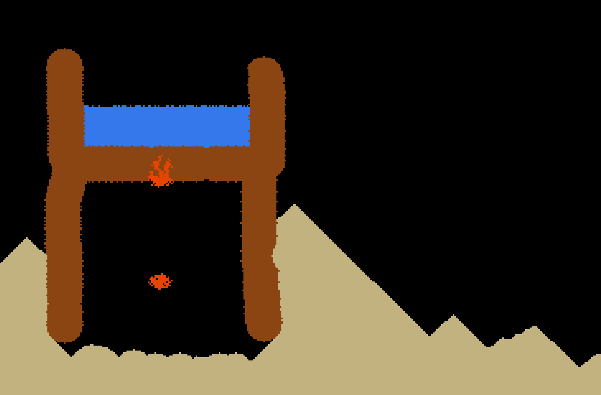

# Assignment brief

Answer to question 1: If G^' started as a grid of zeroes, then a cell that doesnt get updated during the current iteration would disappear as soon as the current iteration's update process ends.

Answer to question 2: If the order in which columns are visited is not randomly generated every time, and is instead left-to-right, then that would create a bias in the simulation that would skew sand piles to the right. (sand cells in the columns on the left would fall first, occupying lower positions, and hence cells in columns on the right would have nowhere to fall (they would occupy higher positions).)

Answers to other questions in the assignment PDF:
- Yes, sand did pile up how I expected it to.
- Yes, water pooled flat (except the uppermost layer)
- For bonus materials, I made this scene: (screenshot attached below); and what surprised me was the speed at which fire and smoke rose up.
